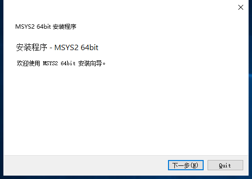
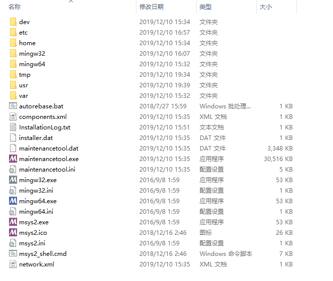
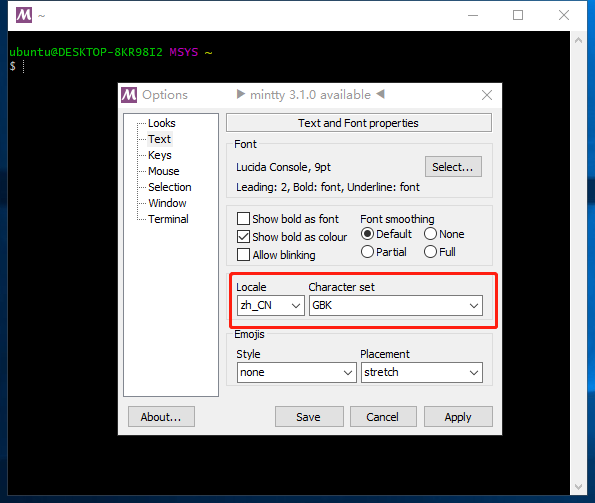
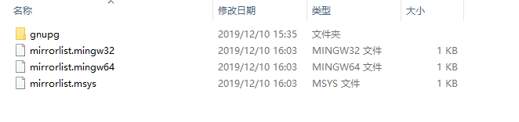
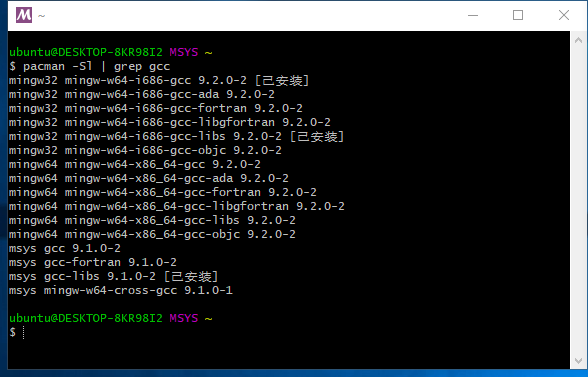

# mingw 编译 ffmpeg

## msys2 安装

msys2 是一个类似linux环境，上网下载一个 msys2 64或者32位版本安装

我这里安装的是64位版本，按照默认的方式安装

安装完成之后，可以简单看一下安装路径下的文件层次结构

### 更新字符集(不太重要)

打开安装目录下的 `msys2_shell.cmd` 文件, 在弹窗的标题栏上，右击选择 `Options...` , 选择 `Text` , 更改显示中文的字符集为 `GBK` ，避免乱码.如下图

### 配置镜像源

msys2 使用的是 Pacman 进行包管理，在下载安装第三方库的时候，需要先更改使用的镜像源

以我的为例， 我将 `msys2` 安装在 `C:\msys64` , 管理镜像源的文件在路径 `C:\msys64\etc\pacman.d` 文件夹下,如下图，将文件地址更改为国内的中科大镜像

分别更新 mirrorlist.mingw32 文件

    Server = http://mirrors.ustc.edu.cn/msys2/mingw/i686/
    Server = http://repo.msys2.org/mingw/i686
    Server = http://downloads.sourceforge.net/project/msys2/REPOS/MINGW/i686
    Server = http://www2.futureware.at/~nickoe/msys2-mirror/i686/

mirrorlist.mingw64 文件

    Server = http://mirrors.ustc.edu.cn/msys2/mingw/x86_64/
    Server = http://repo.msys2.org/mingw/x86_64
    Server = http://downloads.sourceforge.net/project/msys2/REPOS/MINGW/x86_64
    Server = http://www2.futureware.at/~nickoe/msys2-mirror/x86_64/
    Server = http://mirror.bit.edu.cn/msys2/REPOS/

mirrorlist.msys 文件

    Server = http://mirrors.ustc.edu.cn/msys2/msys/$arch/
    Server = http://repo.msys2.org/msys/$arch
    Server = http://downloads.sourceforge.net/project/msys2/REPOS/MSYS2/$arch
    Server = http://www2.futureware.at/~nickoe/msys2-mirror/msys/$arch/

### msys2 更新

运行 msys2_shell.cmd , 升级系统以及所有安装的软件

    pacman -Syu

之后关闭所有msys2 的 shell 窗口， 执行msys2安装的根目录下的 `autorebase.bat` 文件

### 安装其他编译需要的库

    pacman -S make 
    pacman -S yasm
    pacman -S pkg-config
    pacman -S diffutils

这些库具体的功能，可以自己了解一下，这里就不解释，主要还是编译ffmpeg

## mingw 安装

打开安装目录下的 `msys2_shell.cmd` 文件, 首先查看已经提供的 GCC 版本选择

如图， 可以看到2个版本的 `gcc` , 32位和64位， 根据实际的需要选择安装， 我这里安装的是32位

    pacman -S mingw-w64-i686-gcc

msys2 会自动将这个包装在 `C:\msys64\mingw32`

同理，如果需要编译64位的

    pacman -S mingw-w64-x86_64-gcc

## 编译ffmpeg

首先通过 github clone ffmpeg 源码

剩下的就是编译， 打开 `mingw32.exe` , cd 到 ffmpeg 源码路径下

    ./configure --prefix=/usr/local_x86/ffmpeg --enable-shared
    make 
    make install

ffmpeg 编译生成的编译配置文件，参数有很多， 我这里只使用了 --enable-shared 编译出动态库，如果需要添加其他的参数比如 --enable-ffplay, 这里还需要为 msys2 中添加 SDL 相关的库等等， 所以根据实际需求，可以自行添加相应的库
